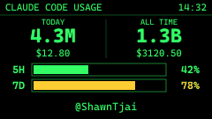
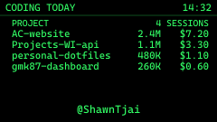
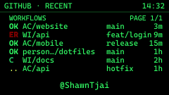
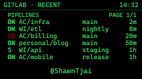
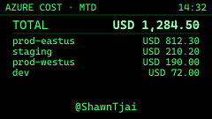
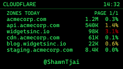
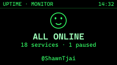
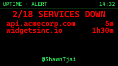

# gmk87-claude-dashboard

Turn a GMK87 keyboard's little TFT screen into a live dashboard. Slot 0 shows your Claude Code usage. Slot 1 rotates through your CI pipelines, cloud spend, and uptime, one slide every five seconds.



The daemon runs on your own machine. It reads your local Claude Code transcripts, calls a few APIs you opt into, renders each slide to a small animated GIF, and uploads it to the keyboard over HID.

## What it shows

The keyboard has two image slots. Press Fn+Enter to cycle the display: clock, then slot 0, then slot 1, then back to the clock.

Slot 0 stays pinned to one view, so you always know where the headline number is:

- Claude Code usage: today's tokens and cost, lifetime totals, and the 5-hour and 7-day rate bars.

Slot 1 cycles through the rest:

- UptimeRobot monitors. Everything reads green in rotation; a monitor that goes down pins itself as a priority slide and turns the underglow red.
- Azure spend per subscription.
- Cloudflare zones, paged six at a time.
- GitLab pipelines: what is running now, plus recent runs.
- GitHub workflows: what is running now, plus recent runs.
- Coding activity today: your top projects by token spend.

Every slide except Claude usage is optional. A slide shows up only if you create its config file. See Integrations below.

## Screens

Shown with sample data.

| | |
|:--:|:--:|
| <br>Claude Code usage | <br>Coding activity today |
| <br>GitHub workflows | <br>GitLab pipelines |
| <br>Azure spend | <br>Cloudflare zones |
| <br>UptimeRobot | <br>UptimeRobot, during an outage |

## How it works

- Reads `~/.claude/projects/**/*.jsonl` to total today's and lifetime tokens and cost, deduplicated by `message.id`.
- Watches that directory with chokidar, so it refreshes when a transcript changes.
- Runs a small HTTP server on `http://127.0.0.1:<port>` that Claude Code's hooks POST to: one beacon per tool call, and one each on session start and stop. That feeds an intensity score from 0 to 100 (idle, low, med, hot), so the display gets busier when more sessions and sub-agents run at once.
- Renders each view as SVG, converts it to PNG with sharp, assembles an animated GIF with gif-encoder-2, and uploads it to the keyboard.
- Re-uploads only on a change worth showing: a token or cost boundary, a bucket change, a session-count change, the minute tick for the clock, or a five-minute heartbeat. Uploads are at least five seconds apart.
- Keeps a durable usage ledger at `.runtime/ledger.json`, so the lifetime total survives Claude Code deleting old transcripts. Without it, the total drops whenever a session's `.jsonl` gets cleaned up.
- On a clean shutdown it puts the keyboard back to its built-in clock. On a fatal error it force-kills its own process, so Task Scheduler relaunches it with fresh HID handles instead of leaving a wedged process holding the device.

## The keyboard

This runs on the Zuoya GMK87, a TKL board with a 240x135 TFT screen and a knob. The screen is what the dashboard draws to. Knob rotation stays mapped to volume through [VIA](https://www.usevia.app/); only the knob click is remapped, to F23, so the daemon can use it to lock the current slide. VIA is also where you do that remap.

Where to buy: the links below are affiliate links, so I may earn a small commission at no extra cost to you. They all point to the same Zuoya GMK87 from different sellers. I list a few as backups, in case one runs out of stock or gets taken down.

- Zuoya GMK87 (affiliate): https://s.shopee.sg/30neHcu1kT
- Zuoya GMK87 (affiliate): https://s.shopee.sg/2qUE5Juf5S
- Zuoya GMK87 (affiliate): https://s.shopee.sg/2gAnt0vIQR

## Requirements

- A GMK87 keyboard with the TFT screen.
- Node.js 20 or newer.
- Windows. The install scripts use Task Scheduler and a VBScript launcher, and input capture uses uiohook-napi.
- Claude Code, for the usage and activity views.

## Setup

```bash
npm install
npm run install-hook   # adds PostToolUse / SessionStart / Stop hooks to ~/.claude/settings.json
npm run install-task   # registers a Task Scheduler entry that starts the daemon at logon
npm start              # run it once now; Task Scheduler starts it for you next logon
```

`install-hook` backs up your `settings.json` before it edits it.

## Integrations

Each integration stays off until you add its config file. Copy the matching `*.config.example.json` to the real name and fill in your own values. The real files are gitignored.

| Slide | Copy this | You provide |
| --- | --- | --- |
| Claude usage, coding activity | nothing | reads local transcripts |
| GitHub workflows | `github.config.example.json` | a PAT with `repo` scope, or fine-grained with Actions: read |
| GitLab pipelines | `gitlab.config.example.json` | a token with `read_api` scope |
| UptimeRobot | `uptimerobot.config.example.json` | a read-only API key |
| Azure spend | `azure.config.example.json` | a service principal per account (tenant, client, secret) |
| Cloudflare zones | `cloudflare.config.example.json` | an API token per account |

Each example file has comments with the exact scopes and the page to get the token or key. No credential goes in the repo: the real config files and `.env` are gitignored.

## Cost math

Costs use Anthropic's API list prices:

- Input: $15/M for Opus, $3/M for Sonnet, $1/M for Haiku.
- Cache write, 5 minute: 1.25x input.
- Cache write, 1 hour: 2.0x input. Claude Code's longer sessions usually land here.
- Cache read: 0.1x input.
- Output: 5x input.

The headline token total leaves out cache reads, which matches Anthropic's own dashboard. Cache reads still count toward the cost figure at 0.1x, and they are tracked separately for diagnostics. The rate table lives in `src/rates.js`; edit it when pricing changes.

## Controls

- Fn+Enter cycles clock, slot 0, slot 1.
- Knob rotation: volume.
- Knob click: lock or unlock the current slide, so it stops rotating while you read it.

## Uninstall

```bash
npm run uninstall-hook
npm run uninstall-task
# then delete the project folder
```

## Project layout

- `src/index.js`: daemon entrypoint, lifecycle, refresh loop.
- `src/stats.js`: transcript parser and daily/lifetime aggregator, with message.id dedup.
- `src/ledger.js`: durable per-session usage ledger.
- `src/rates.js`: per-model token prices.
- `src/activity.js`: intensity tracker and active-session scanner.
- `src/usage-api.js`: the 5-hour and 7-day rate bars.
- `src/uploader.js`: wraps the gmk87-node API to upload slots and switch the display.
- `src/lighting-indicator.js`: the LED lock indicator and the red outage underglow.
- `src/hook-server.js`: the localhost receiver for Claude Code hooks.
- `src/install-hook.js`, `src/uninstall-hook.js`: edit settings.json, with a backup.
- `src/integrations/`: one client per external API.
- `src/views/`: one renderer per slide.
- `scripts/`: the Windows Task Scheduler entry and its launcher.
- `third_party/gmk87-node/`: the bundled keyboard library. See Credits.

## Credits

The keyboard speaks HID through [gmk87-node](https://github.com/codedgar/gmk87-node) by Edgar Pérez, MIT licensed. It handles image upload, lighting, and time sync. A copy of its runtime library is bundled under `third_party/gmk87-node/`; see NOTICE for what is included and what is left out.

## License

MIT, see LICENSE. Bundled third-party code keeps its own license under `third_party/`.
